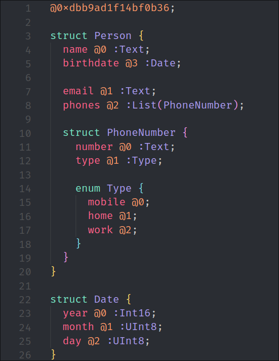
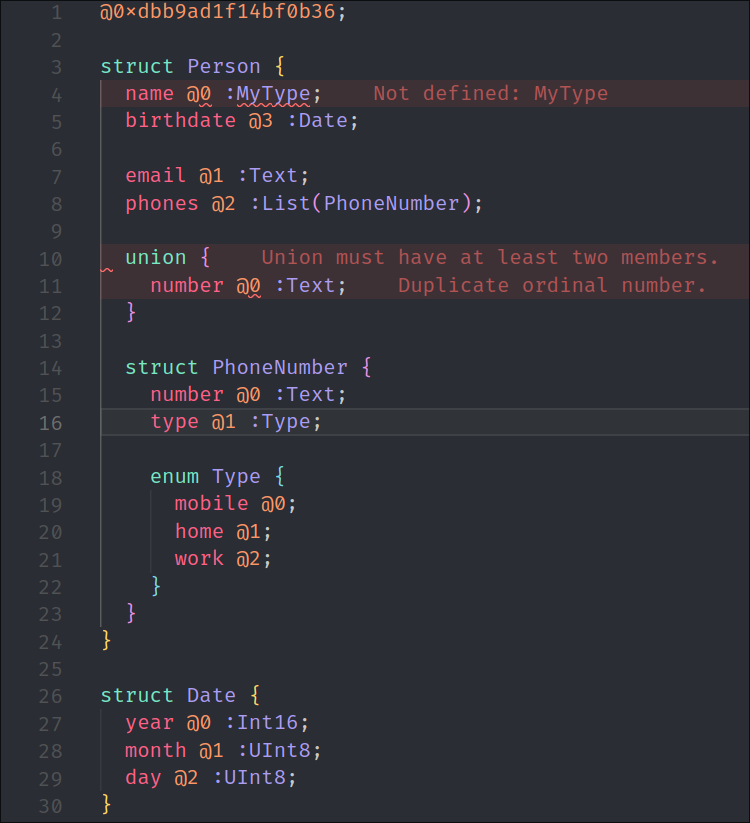
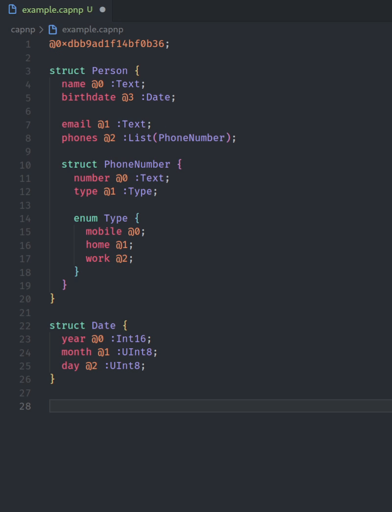

# Cap'n Proto
This extension adds support for the Cap'n Proto *cerealization* protocol. Yes, the protocol that is "**INFINITY TIMES faster than Protobuf**."

The features that are supported can be found in the [Features](#features) section.

## Features

### Syntax Highlighting

### Code Diagnostics

### Commands

## Requirements
 * The [Cap'n Proto tools](https://capnproto.org/install.html) must be installed in order to use the code diagnostics feature.

## Changelog
The changelog can be found in the [CHANGELOG.md file](CHANGELOG.md).
